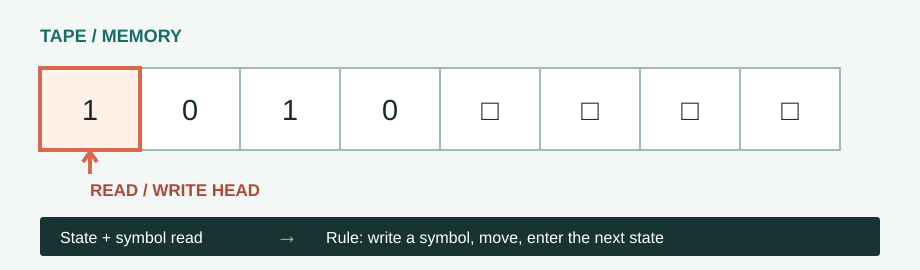

# The Turing Machine

**1936 · Foundations of computation**

What does it mean to compute something? [Alan Turing](#about-alan-turing){ data-open-details } answered with a deliberately simple imaginary machine: a tape for memory, a head that reads and writes, and rules that tell it what to do next.

[← Timeline](../index.md){ .chapter-back title="Back to chapter timeline" }

## What is the machine?

A Turing machine is a theoretical model Alan Turing introduced in 1936 to study what can be computed by following exact instructions. It was not a physical computer he built.

It is an abstract computer with four parts:

1. **Tape:** a sequence of cells that stores symbols. In the theory, the tape can extend as far as the computation needs.
2. **Read/write head:** examines one cell, can replace its symbol, and moves along the tape.
3. **State:** remembers which stage of the procedure the machine is in.
4. **Transition rules:** determine the next action from the current state and the symbol under the head.

<figure class="turing-diagram">
  
  <figcaption>The tape stores information; the head and rules change it one step at a time.</figcaption>
</figure>

## How it works

At each step, the machine reads the symbol under the head. It then follows a rule to **write a symbol, move the head, and enter a state**. Repeating these small steps produces a computation.

For example, a machine can scan a row containing both `0`s and `1`s. It keeps each `1`, changes each `0` to `1`, and stops when it reaches a blank cell:

| State | Read | Write | Move | Next state |
| --- | --- | --- | --- | --- |
| Scan | `1` | `1` | Right | Scan |
| Scan | `0` | `1` | Right | Scan |
| Scan | blank | blank | Stay | Halt |

Starting with `1010`, the head leaves the first and third cells as `1`, changes the second and fourth cells to `1`, and stops at the blank. The result is `1111`.

### Try it yourself

Press **Step** to see one rule applied at a time, or **Play** to let the machine run. **Reset** returns it to `1010`.

  
SCAN 1s AND 0sReady

  

  

    <button type="button" data-machine-step>Step</button>
    <button type="button" data-machine-play>Play</button>
    <button type="button" data-machine-reset>Reset</button>
  

  

The display shows seven cells so the movement is easy to follow. The mathematical model is not limited to seven cells.

## Key insights

**A small set of mechanical rules can describe a general process of computation.** Turing's model gave computer science a precise way to discuss algorithms and their limits. It did not claim that following rules alone makes a machine intelligent; it established the computational foundation on which later AI ideas could be explored.

The next milestone asks a different question: can a simplified neuron perform computation? [Continue to the McCulloch–Pitts neuron](02-mcculloch-pitts-neuron.md).

More about Alan Turing

<figure class="turing-portrait">
  
  <figcaption>Alan Turing in 1936. Photograph: unknown photographer, via <a href="https://commons.wikimedia.org/wiki/File:Alan_Turing_(1912-1954)_in_1936_at_Princeton_University.jpg">Wikimedia Commons</a>.</figcaption>
</figure>

Alan Turing (1912–1954) was a British mathematician whose work helped establish the theory of computation. In his 1936 paper, he asked which mathematical procedures could be carried out by a machine following exact instructions. His answer was a theoretical model, not a computer he physically built.

That model matters to AI because AI systems also run procedures. Before asking whether a machine can reason or learn, it helps to understand what following a computable procedure means.

**References:** _AI In Society_, Chapter 2 learning notes, pp. 1–2; Alan Turing, “On Computable Numbers, with an Application to the Entscheidungsproblem” (1936). Portrait source: [Wikimedia Commons](https://commons.wikimedia.org/wiki/File:Alan_Turing_(1912-1954)_in_1936_at_Princeton_University.jpg).
