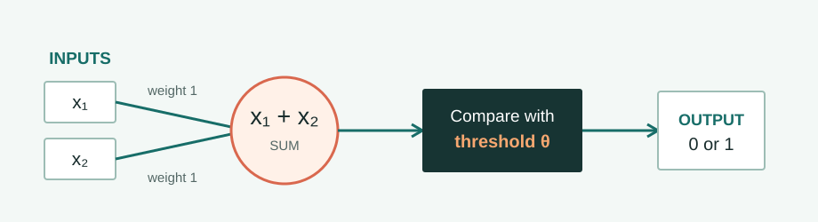

# The McCulloch–Pitts Neuron

**1943 · Computation meets the neuron**

Could a simple model of a neuron perform a logical calculation? [Warren McCulloch and Walter Pitts](#about-mcculloch-and-pitts){ data-open-details } showed how a network of idealized neurons could be described using logic.

[← Timeline](../index.md){ .chapter-back title="Back to chapter timeline" }

## What is the model?

The McCulloch–Pitts neuron is an **idealized binary unit**. It receives inputs that are either `0` or `1` and produces an output that is also `0` or `1`. A threshold decides when the unit switches on.

<figure class="turing-diagram">
  
  <figcaption>Two inputs are combined, then compared with a threshold.</figcaption>
</figure>

For the example below, each input has weight `1`. The unit adds them and outputs `1` when the sum reaches the threshold. This familiar weighted-sum notation is a **simplified modern presentation**; the original 1943 model was more specialized and did not learn its weights from data.

## How it works

Choose a threshold of `2` and two binary inputs, `x₁` and `x₂`. The output is `1` only when both inputs are `1`. That is the logical **AND** operation.

| Input `x₁` | Input `x₂` | Sum | Output with threshold `2` |
| --- | --- | --- | --- |
| `0` | `0` | `0` | `0` |
| `0` | `1` | `1` | `0` |
| `1` | `0` | `1` | `0` |
| `1` | `1` | `2` | `1` |

### Try the threshold

Switch the inputs on and off. Then select **OR** to lower the threshold to `1`: now either input is enough to produce `1`.

  
BINARY NEURONAND · threshold 2

  

    <button type="button" data-neuron-mode="and" aria-pressed="true">AND · 2</button>
    <button type="button" data-neuron-mode="or" aria-pressed="false">OR · 1</button>
  

  

    <label class="neuron-input"><input type="checkbox" data-neuron-input="0">x₁<strong data-neuron-value="0">0</strong></label>
    <label class="neuron-input"><input type="checkbox" data-neuron-input="1">x₂<strong data-neuron-value="1">0</strong></label>
  

  
Sum <strong data-neuron-sum>0</strong>→Threshold <strong data-neuron-threshold>2</strong>→Output <strong class="neuron-output" data-neuron-output>0</strong>

  

## Key insights

**Simple neuron-like units can perform logical computation.** Changing only the threshold lets the same two inputs behave like AND or OR. This linked ideas about biological neurons, mathematical logic, and computation.

The model was an important conceptual step toward neural networks, but it was not a modern learning algorithm. Its inputs and rules were fixed by the designer. Learning from examples comes later in this chapter.

The next milestone returns to Turing and asks how we might judge intelligent behavior. [Continue to the Turing test](03-turing-test.md).

More about McCulloch and Pitts

  <figure>
    
    <figcaption>Warren McCulloch (left), 1960. <a href="https://mitmuseum.mit.edu/collections/object/GCP-00018255">MIT Museum collection</a>.</figcaption>
  </figure>
  <figure>
    
    <figcaption>Walter Pitts. Photograph via <a href="https://cabinetmagazine.org/issues/5/easterling.php">Cabinet Magazine</a>.</figcaption>
  </figure>

**Warren McCulloch** was a neurophysiologist interested in how nervous systems process information. He brought questions about brain activity into conversation with logic and computation.

**Walter Pitts** was a largely self-taught logician. His interest in formal reasoning helped turn their shared question into a mathematical model. Together they published **“A Logical Calculus of the Ideas Immanent in Nervous Activity”** in 1943, showing how networks of idealized neurons could carry out logical operations.

**References:** [TUM, *AI in Society - Foundations of AI and Data Science*, Chapter 2](https://www.gov.sot.tum.de/fileadmin/w00bzh/rds/_my_direct_uploads/AI_in_Society-Foundations_of_AI_and_Data_Science_01.pdf); Warren S. McCulloch and Walter Pitts, “A Logical Calculus of the Ideas Immanent in Nervous Activity” (1943).
