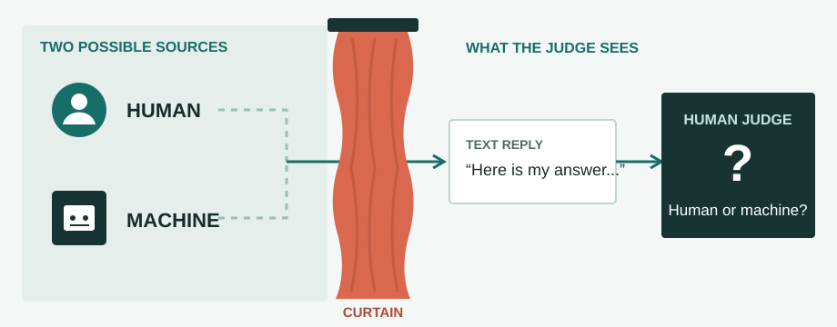

# The Turing Test

**1950 · A new question about intelligence**

After asking what machines can compute, [Alan Turing](01-turing-machine.md#about-alan-turing) asked how we might judge whether a machine behaves intelligently. His *imitation game* shifted attention to what an observer can learn from a conversation.

[← Timeline](../index.md){ .chapter-back title="Back to chapter timeline" }

## What is the test?

The Turing test is a thought experiment associated with Turing's 1950 paper, **“Computing Machinery and Intelligence.”** In the common simplified version, a human judge exchanges written messages with a human and a machine without seeing either one. The judge tries to identify which participant is the machine.

<figure class="turing-diagram">
  
  <figcaption>For each anonymous reply, the judge has to infer which hidden participant sent it.</figcaption>
</figure>

The test is about **observable conversational behavior**. It does not directly inspect a machine's code, inner experience, or understanding.

## How it works

1. A judge sends questions through a text channel.
2. Two hidden participants reply: one human, one machine.
3. The judge compares the replies and decides which participant is which.

Text matters because it removes clues such as appearance and voice. A single answer is rarely enough; the judge can ask follow-up questions and look at the pattern of responses.

## Key insights

Turing turned an abstract question, **“Can machines think?”**, into a question about behavior that an observer could test. That made the discussion more concrete without settling what thinking itself is.

**Being mistaken for a human would not, by itself, prove consciousness or understanding.** It would show that a machine's behavior was persuasive under the conditions of that test. This distinction remains important whenever we evaluate AI through its outputs.

The three early foundations ask different questions: the [Turing machine](01-turing-machine.md) concerns computation; the [McCulloch–Pitts neuron](02-mcculloch-pitts-neuron.md) links neural activity and logic; the Turing test concerns apparent intelligence in interaction.

Next, researchers began treating AI as a field in its own right. [Continue to the Dartmouth workshop](../02-ai-becomes-a-field/01-dartmouth-workshop.md).

More about Turing's original proposal

The term *Turing test* is a later shorthand. Turing's paper described an **imitation game**, and the familiar “human versus machine” version above is a simplified way to introduce it. The central teaching idea is the same: judge a machine by its responses in a text-based exchange rather than by assuming a definition of thinking.

**References:** _AI In Society_, Chapter 2 learning notes, p. 5; Alan M. Turing, “Computing Machinery and Intelligence” (1950).
