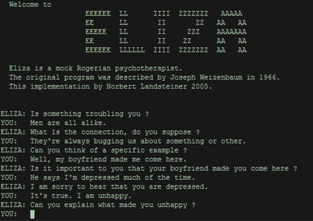

# ELIZA

**1966 · A conversation that seemed to listen**

Could a computer appear to hold a conversation without understanding what a person meant? **ELIZA** showed how far carefully chosen text rules could go.

[← Timeline](../index.md){ .chapter-back title="Back to chapter timeline" }

## What is it?

[Joseph Weizenbaum](#joseph-weizenbaum){ data-open-details } created ELIZA at MIT. Its best-known script, **DOCTOR**, imitated a non-directive therapist by turning parts of a person's message into questions or prompts. ELIZA was a program; DOCTOR was one set of conversation rules it could run.

## How it works

ELIZA looked for **keywords and sentence patterns**, then used scripted rules to assemble a reply. A response could sound attentive even when the program had no grasp of the person's situation.

<figure class="eliza-printout">
  
  <figcaption>ELIZA conversation (2005 recreation). Source: <a href="https://www.gov.sot.tum.de/fileadmin/w00bzh/rds/_my_direct_uploads/AI_in_Society-Foundations_of_AI_and_Data_Science_01.pdf">AI in Society</a>, Figure 4.</figcaption>
</figure>

## Key insights

ELIZA made **pattern-based replies feel like understanding**. Weizenbaum was struck by how readily some users treated the program as a listener. A convincing conversation, though, did not mean the program understood feelings or provided real therapy.

[Next: the perceptron's limitations](06-perceptron-limitations.md).

More about Joseph Weizenbaum

  <figure>
    
    <figcaption>Joseph Weizenbaum, 2005. Photo by <a href="https://commons.wikimedia.org/wiki/File:Joseph_Weizenbaum.jpg">Ulrich Hansen / Wikimedia Commons</a>, <a href="https://creativecommons.org/licenses/by-sa/3.0/">CC BY-SA 3.0</a>.</figcaption>
  </figure>

Joseph Weizenbaum (1923–2008) was a German-American computer scientist and MIT professor. After creating ELIZA, he became a prominent critic of treating computers as substitutes for human judgment and care.

**References:** [Weizenbaum's 1966 ELIZA paper](https://courses.cs.umbc.edu/331/papers/eliza.html); [MIT's biography of Weizenbaum](https://news.mit.edu/2008/obit-weizenbaum-0310); [ELIZA Archaeology Project](https://findingeliza.org/).
