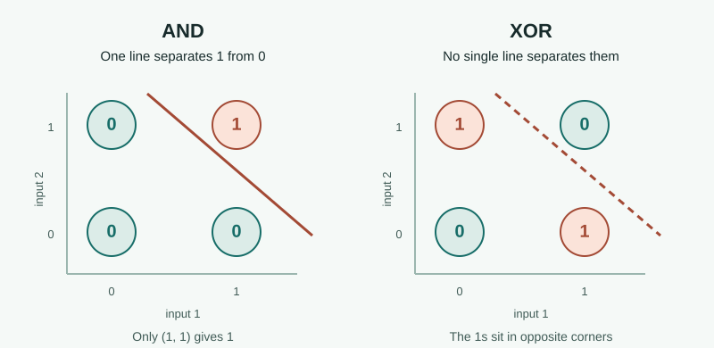

# Perceptron Limitations

**1969 · A boundary learning cannot cross**

The [perceptron](03-perceptron.md) could learn by changing its weights. But changing weights cannot solve a problem if the model cannot represent the answer in the first place.

[← Timeline](../index.md){ .chapter-back title="Back to chapter timeline" }

## What is the limitation?

A **single-layer perceptron** first calculates a weighted sum, `w₁x₁ + w₂x₂ + b`, then outputs `1` if that sum passes a threshold and `0` otherwise. Changing the weights moves the boundary, but that boundary is always **one straight line** for two inputs.

## How does XOR show it?

First, compare **AND**: it gives `1` only when *both* inputs are `1`. In the left plot, one straight line puts that single `1` on one side and all three `0`s on the other. A perceptron can learn this boundary.

**XOR** means “one or the other, but not both.” It gives `1` when the inputs differ and `0` when they match. In the right plot, the two `1`s are in opposite corners. A line that separates one of them also leaves a `0` on its side, so no single line works.

For inputs that can only be `0` or `1`, **`XOR(x₁, x₂) = |x₁ − x₂|`**. Absolute value is **non-linear**: it turns both `-1` and `+1` into `1`, but leaves `0` as `0`. A perceptron instead thresholds a linear weighted sum, so it draws just one straight boundary. The formula hints at the mismatch; the opposite-corner pattern in the diagram shows exactly why no such line can separate XOR's outputs. The shape of the decision boundary, rather than the presence of a non-linear symbol in a formula, is what matters.

<figure class="xor-diagram">
  
  <figcaption>AND works with one straight boundary. XOR needs more than one.</figcaption>
</figure>

So the problem is **not that the perceptron has the wrong weights**. No choice of weights in its linear equation can separate these four points. A network with a hidden layer can combine multiple boundaries to represent XOR.

## Key insights

In their 1969 book *Perceptrons*, [Marvin Minsky](#marvin-minsky-limitations){ data-open-details } and [Seymour Papert](#seymour-papert){ data-open-details } studied important limits of perceptron-style systems. **The XOR limit applies to a single-layer perceptron**, not to every neural network.

The deeper lesson is to ask **what a model can represent**, not only how well it can learn. The book did not prove that neural-network research as a whole was impossible.

  

    
Marvin Minsky

    
    

      
Marvin Minsky (1927–2016) was an American AI researcher and co-founder of MIT's Artificial Intelligence Laboratory. His work ranged from neural networks to theories of human thought.

      
Photo: <a href="https://commons.wikimedia.org/wiki/File:Marvin_Minsky.jpg">Steamtalks / Wikimedia Commons</a>, <a href="https://creativecommons.org/licenses/by-sa/2.0/">CC BY-SA 2.0</a>. Biography: <a href="https://news.mit.edu/2016/marvin-minsky-obituary-0125">MIT News</a>.

    

  

  

    
Seymour Papert

    
    

      
Seymour Papert (1928–2016) was a South African-born mathematician, AI researcher, and educator at MIT. He also helped create Logo, a programming language designed for children.

      
Photo: <a href="https://commons.wikimedia.org/wiki/File:Seymour_Papert.png">Rodrigo Mesquita / Wikimedia Commons</a>, <a href="https://creativecommons.org/licenses/by-sa/2.0/">CC BY-SA 2.0</a>. Biography: <a href="https://news.mit.edu/2016/seymour-papert-pioneer-of-constructionist-learning-dies-0801">MIT News</a>.

    

  

**References:** [TUM, *AI in Society - Foundations of AI and Data Science*, Chapter 2](https://www.gov.sot.tum.de/fileadmin/w00bzh/rds/_my_direct_uploads/AI_in_Society-Foundations_of_AI_and_Data_Science_01.pdf); [MIT Press, *Perceptrons*](https://mitpress.mit.edu/9780262130431/perceptrons/); [Stanford course notes on XOR and linear separability](https://web.stanford.edu/class/cs379c/resources/lectures/).
