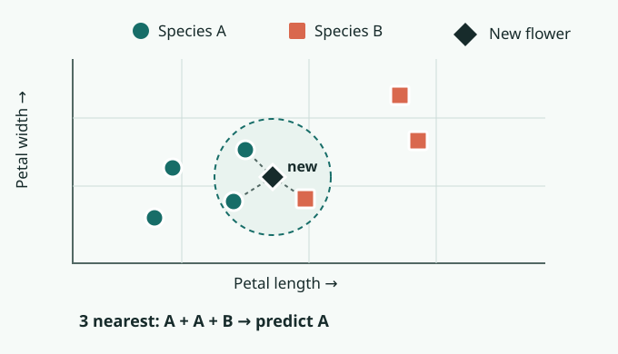

# Nearest Neighbors

**1967 · Learning from examples**

Instead of writing a rule for every case, compare a new case with examples whose answers are already known.

[← Timeline](../index.md){ .chapter-back title="Back to chapter timeline" }

## What is it?

**Nearest-neighbor classification** puts a new item into a category by comparing it with similar items that have already been identified. An influential 1967 study helped establish this approach.

## How does it work?

Imagine identifying a flower's **species** from its **petal length** and **petal width**. Each flower of a known species becomes a point on a chart. For a new flower, find the closest points and let their species labels vote. Here, **two of the three closest** are Species A, so the prediction is A. Species A and B are made-up names for this example.

<figure class="stat-figure">
  
  <figcaption>A simplified example with <em>k</em> = 3. The dashed lines show the three neighbors used for the vote.</figcaption>
</figure>

What counts as “close” depends on the measurements and distance rule. Poorly chosen measurements can make the vote misleading.

## Key insight

The labeled examples themselves guide the prediction. Unlike a [perceptron](03-perceptron.md), this method does not first learn one fixed linear boundary.

**References:** [TUM, *AI in Society - Foundations of AI and Data Science*, Chapter 2](https://www.gov.sot.tum.de/fileadmin/w00bzh/rds/_my_direct_uploads/AI_in_Society-Foundations_of_AI_and_Data_Science_01.pdf); [the 1967 nearest-neighbor paper](https://doi.org/10.1109/TIT.1967.1053964).
