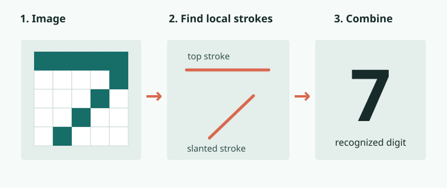

# Early Convolutional Networks

**1980s · Learning from images**

Researchers began building networks that recognized images in stages, starting with small visual patterns.

[← Timeline](../index.md){ .chapter-back title="Back to chapter timeline" }

## What are they?

An early **convolutional network** looked at small parts of an image and combined what it found across several layers. “Convolutional” refers to using the same small pattern detector at different positions in the image. The [**neocognitron (1980)**](#neocognitron){ data-open-details } was an important early step; later networks also learned from labeled examples of handwritten characters.

## How do they work?

Think of a simple pixel drawing of **7**. One stage can find its short top line and slanted line. A later stage can combine those clues to recognize the digit. The same small detector scans different parts of the image, so a stroke need not appear in exactly one position.

<figure class="stat-figure">
  
  <figcaption>A simplified illustration of the layered idea, not a diagram of one historical network's exact architecture.</figcaption>
</figure>

Later convolutional networks used [backpropagation](02-backpropagation.md) to adjust their detectors from labeled images. The early systems differed in design and training, but shared this idea of building larger visual patterns from smaller ones.

## Key insight

**Image structure matters.** Nearby pixels form strokes; strokes can form a digit. Reusing small detectors and combining their results became a foundation for later image-recognition networks.

What was the neocognitron?

The **neocognitron** was a layered vision network described in 1980. It was designed to recognize a shape even when its position in the image shifted. It was an ancestor of later convolutional networks, though their designs and training methods differed.

**References:** [TUM, *AI in Society - Foundations of AI and Data Science*, Chapter 2](https://www.gov.sot.tum.de/fileadmin/w00bzh/rds/_my_direct_uploads/AI_in_Society-Foundations_of_AI_and_Data_Science_01.pdf); [the neocognitron paper](https://www.cs.princeton.edu/courses/archive/spring08/cos598B/Readings/Fukushima1980.pdf).
