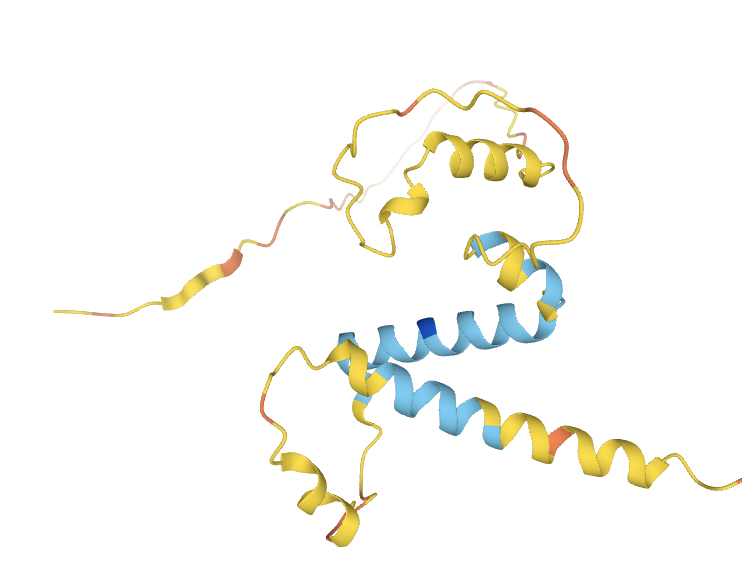

# Beyond Language Models

**2020s · AI beyond text**

[← Timeline](../index.md){ .chapter-back title="Back to chapter timeline" }

## What changed?

By the 2020s, some of AI's most visible advances went beyond text: helping with scientific problems and connecting images, sound, and language within a task.

## AlphaFold: AI for biology

**AlphaFold 2** made its major breakthrough in **2020**, when it performed exceptionally well in a challenge where the correct protein structures were hidden from participants. Its method was published in **2021**. It predicts a protein's three-dimensional shape using its amino-acid sequence (the order of its building blocks) and information from related sequences. The result is a useful prediction, not a replacement for every laboratory experiment.

<figure class="protein-figure">
  
  <figcaption>AlphaFold prediction of human C2orf80. Blue indicates higher confidence; yellow and orange indicate lower confidence. Image: <a href="https://commons.wikimedia.org/wiki/File:Alphafold_3D_c2orf80_protein.png">Wikimedia Commons</a> (AlphaFold, uploaded by Eptio), <a href="https://creativecommons.org/licenses/by-sa/4.0/">CC BY-SA 4.0</a>.</figcaption>
</figure>

**Key insight:** Learning systems could help solve a scientific problem that is not about conversation or text generation.

## Multimodal AI: connecting kinds of data

**Multimodal** means working with more than one *modality*, or kind of data, such as images, text, or sound. The idea predates the 2020s, but image-text models became especially prominent then. [**CLIP (2021)**](#clip){ data-open-details } connected images with written descriptions. Later multimodal systems can take a photograph and a question such as "What is on the table?" and answer using both.

**Key insight:** A model can connect information across different forms, rather than handling each one in isolation.

What is CLIP?

**CLIP** (Contrastive Language-Image Pre-training) is an **AI model** trained on image-text pairs to judge which description best matches an image. Given a bicycle photo and the choices "a bicycle" and "a dog," it can score the bicycle description higher. CLIP does not itself answer open-ended questions about an image.

## What ties them together?

AI's progress is not only measured by better text generation. It also appears in **new domains and combinations of data**. Each system still needs to be tested for the specific task where it is used.

**References:** [TUM, *AI in Society - Foundations of AI and Data Science*, Chapter 2](https://www.gov.sot.tum.de/fileadmin/w00bzh/rds/_my_direct_uploads/AI_in_Society-Foundations_of_AI_and_Data_Science_01.pdf); [AlphaFold timeline](https://deepmind.google/science/alphafold/); [AlphaFold research paper](https://www.nature.com/articles/s41586-021-03819-2); [CLIP research overview](https://openai.com/index/clip/).
